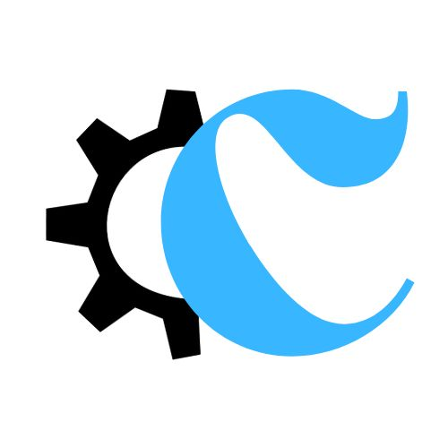

<p align="center">
  <a href="" rel="noopener">
 </a>
</p>

<h3 align="center">Reporting</h3>

<div align="center">

[]()
[](https://github.com/iliasanouar0/Code-source/issues)
[](https://github.com/iliasanouar0/Code-source/pulls)

</div>

---

<p align="center"> Building a web application for email reporting and management
    <br> 
</p>

## 📝 Table of Contents

- [📝 Table of Contents](#-table-of-contents)
- [🏁 Getting Started ](#-getting-started-)
  - [Prerequisites](#prerequisites)
    - [Update the system :](#update-the-system-)
    - [Node.js -v \>= 16 :](#nodejs--v--16-)
  - [Installing](#installing)
  - [Required files](#required-files)
    - [Installing PM2 'PROCESS MANAGER FOR NODE.JS'](#installing-pm2-process-manager-for-nodejs)
    - [Cloning the application || Download the zip folder](#cloning-the-application--download-the-zip-folder)
    - [installing chromium](#installing-chromium)
    - [Starting Express.js \& Node.js server](#starting-expressjs--nodejs-server)
    - [Accessing the application and installation](#accessing-the-application-and-installation)
- [⛏️ Built Using ](#️-built-using-)
- [✍️ Authors ](#️-authors-)

## 🏁 Getting Started <a name = "getting_started"></a>

These instructions will get you a copy of the project up and running on your server.

### Prerequisites

#### Update the system :

```
sudo yum update -y
```

#### Node.js -v >= 16 :

- Node.js packages are provided through the NodeSource Node.js Binary Distributions via .rpm,
Add the repository to the system using the commands below 

```
curl -fsSL https://rpm.nodesource.com/setup_16.x | sudo bash -
```

- Once the repository has been configured on your CentOS server you can proceed to install Node.js 16:

```
sudo yum install -y nodejs
```

- Confirm that you can start node shell:

```
node
```
- output:  <br> 
 Welcome to Node.js v16.\*.\*.  <br> 
 Type ".help" for more information.  <br> 
 \> .exit  <br> 

### Installing

- Before installation is preferred to check httpd server & Webmin & PostgreSQL Database Server configuration.

- Creating database "report".

- And Grant Privileges For "root".

### Required files

- The Cookies file.

In the root folder of the server create AppUsers/cookies :<br>
1:
```
mkdir AppUsers
```
2:
```
cd AppUsers
```
3 :
```
mkdir cookies
```

- The log file.

In the home folder of the server create /home/LogReportingAction/ :<br>
1:
```
cd /home
```
2:
```
mkdir LogReportingAction
```
#### Installing PM2 'PROCESS MANAGER FOR NODE.JS'

```
npm install pm2 -g
```

#### Cloning the application || Download the zip folder

In your server folder Clone application using : 

```
git clone https://github.com/iliasanouar0/Code-source.git
```

Or you can download and copy the application folder in server from here => [Application](https://codeload.github.com/iliasanouar0/Code-source/zip/refs/heads/master)

#### installing chromium

In the application folder :

```
cd application-name*/server/node_modules/puppeteer
```
*make sure to change the application-name

run npm install to install all dependencies :

```
npm install
```

#### Starting Express.js & Node.js server

In your server in the application folder : 
```
cd application-name*/server/
```
*make sure to change the application-name

Start server using PM2 command
```
pm2 start index.js --watch
```
In case you want to follow server state and log 
```
pm2 plus
```
and follow the steps ...

#### Accessing the application and installation

- After finishing setting up the server side, Let's go and open the application in browser.<br>
- After oping in th first time the application will start installation and configuration.<br>
- Follow the steps of installation.🧐<br>
- After the installation done we will have the login and password to start using application.<br>
- The application in first will be in development mode, add local and server ips in IP authorization and switch to production.<br>

<!-- ## 🎈 Usage <a name="usage"></a>

Add notes about how to use the system. -->


## ⛏️ Built Using <a name = "built_using"></a>

- [PostgresSql](https://www.postgresql.org/) - PostgresSql
- [Express](https://expressjs.com/) - Server Framework
- [NodeJs](https://nodejs.org/en/) - Server Environment

## ✍️ Authors <a name = "authors"></a>

<!-- - [@kylelobo](https://github.com/kylelobo) - Idea & Initial work -->

See also the list of [contributors](https://github.com/iliasanouar0/Code-source/contributors) who participated in this project.

<!-- ## 🎉 Acknowledgements <a name = "acknowledgement"></a>

- Hat tip to anyone whose code was used
- Inspiration
- References -->
